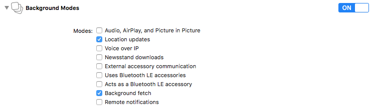

# Curbside Cordova plugin for iOS and Android (version 3.0.0)

This plugin is a wrapper for [Curbside SDK](https://developer.curbside.com/docs/).

---

## Quick install

_Stable version(npm)_

```bash
cordova plugins add curbside-cordova \
    --variable USAGE_TOKEN="..."
```

_Develop version_

```bash
cordova plugin add https://github.com/Curbside/curbside-cordova.git \
    --variable USAGE_TOKEN="..."
```

If you re-install the plugin, remove the plugin then add

```bash
cordova plugin rm curbside-cordova
cordova plugin add curbside-cordova \
    --variable USAGE_TOKEN="..."
```

### Ios

#### Enable Background Modes

1. From the Project Navigator, select your project.
2. Select your target.
3. Select Capabilities.
4. Scroll down to Background Modes.
5. Check Location updates and Background fetch.



Otherwise you will get

```
*** Assertion failure in -[CLLocationManager setAllowsBackgroundLocationUpdates:]
*** Terminating app due to uncaught exception 'NSInternalInconsistencyException', reason: 'Invalid parameter not satisfying: !stayUp || CLClientIsBackgroundable(internal->fClient)'
```

#### Fix Podfile ios version

If you have this error:

```
Installing "curbside-cordova" for ios
Failed to install 'curbside-cordova': Error: pod: Command failed with exit code 1
    at ChildProcess.whenDone (/path/to/your/project/platforms/ios/cordova/node_modules/cordova-common/src/superspawn.js:169:23)
    at emitTwo (events.js:125:13)
    at ChildProcess.emit (events.js:213:7)
    at maybeClose (internal/child_process.js:887:16)
    at Process.ChildProcess._handle.onexit (internal/child_process.js:208:5)
Error: pod: Command failed with exit code 1
```

In your project, edit the file `platforms/ios/Podfile`. Replace `platform :ios, '8.0'` by `platform :ios,'9.0'` Then in
a terminal go to `platforms/ios` then execute

```bash
pod install
```

### Android

#### Add Curbside sdk maven url

In your project, edit the file `platforms/android/build.gradle`.

Replace

```yaml
allprojects {
    repositories {
        jcenter()
        maven {
            url "https://maven.google.com"
        }
    }
}
```

by:

```yaml
allprojects {
    repositories {
        jcenter()
        maven {
            url "https://maven.google.com"
        }
        maven {url "https://raw.github.com/Curbside/curbside-android-sdk-release/master"}
    }
}
```

Otherwise you will get:

```
* What went wrong: A problem occurred configuring root project 'android'.
  > Could not resolve all dependencies for configuration ':_debugApkCopy'. Could not find any matches for
  > com.curbside:sdk:3.0+ as no versions of com.curbside:sdk are available.
       Required by:
           project :
```

## Configuration

You can also configure the following variables to customize the iOS location plist entries

* `LOCATION_WHEN_IN_USE_DESCRIPTION` for `NSLocationWhenInUseUsageDescription` (defaults to "To get accurate GPS
  locations")
* `LOCATION_ALWAYS_USAGE_DESCRIPTION` for `NSLocationAlwaysUsageDescription` (defaults to "To get accurate GPS
  locations")

Example using the Cordova CLI

```bash
cordova plugin add curbside-cordova \
    --variable USAGE_TOKEN="..."
    --variable LOCATION_WHEN_IN_USE_DESCRIPTION="My custom when in use message" \
    --variable LOCATION_ALWAYS_USAGE_DESCRIPTION="My custom always usage message"
```

Example using config.xml

```xml
<plugin name="curbside-cordova" spec="3.0.0">
    <variable name="USAGE_TOKEN" value="YOUR_USAGE_TOKEN_IS_HERE" />
    <variable name="LOCATION_WHEN_IN_USE_DESCRIPTION" value="My custom when in use message" />
    <variable name="LOCATION_ALWAYS_USAGE_DESCRIPTION" value="My custom always usage message" />
</plugin>
```

## Quick example

```html
<script type="text/javascript">
document.addEventListener("deviceready", function() {
  /**
   * Will be triggered when the user is near a site where the associate can be notified of the user arrival.
   */
  Curbside.on("canNotifyMonitoringSessionUserAtSite", function(site){
    // Do something
  })

  /**
   * Will be triggered when the user is approaching a site which is currently tracked for a trip.
   */
  Curbside.on("userApproachingSite", function(site){
    // Do something
  })

  /**
   * Will be triggered when the user has arrived at a site which is currently tracked for a trip.
   */
  Curbside.on("userArrivedAtSite", function(site){
    // Do something
  })

  /**
   * Will be triggered when an error encountered.
   */
  Curbside.on("encounteredError", function(error){
    // Do something
  })

  /**
   * Will be triggered when trackedSites are updated.
   */
  Curbside.on("updatedTrackedSites", function(sites){
    // Do something
  })

  /**
   * trackingIdentifier for the user who is logged into the device. This may be nil when the app is started, but as the
   * user logs into the app, make sure this value is set. trackingIdentifier needs to be set to use session specific methods for starting
   * trips or monitoring sites. This identifier will be persisted across application restarts.
   *
   * When the user logs out, set this to nil, which will inturn end the user session or monitoring session.
   * Note: The maximum length of the trackingIdentifier is 36 characters.
  */
  Curbside.setTrackingIdentifier("USER_UNIQUE_TRACKING_ID", function(error){

  });

  /**
   * Start a trip tracking the user to the site identified by the siteID. Call this method when
   * the application thinks its appropriate to start tracking the user eg. Order is ready to be picked up at
   * the site. This information is persisted across relaunch.
   */
  Curbside.startTripToSiteWithIdentifier("SITE_ID", "UNIQUE_TRACK_TOKEN", function(error){

  });

  /**
   * Completes the trip for the user to the site identified by the siteID with the given trackToken.
   * If no trackToken is specified, then *all* trips to this site  will be completed.
   * Note: Do not call this when the user logs out, instead set the trackingIdentifier to nil when the user logs out.
   */
  Curbside.completeTripToSiteWithIdentifier("SITE_ID", "UNIQUE_TRACK_TOKEN", function(error){

  });

  /**
   * This method would complete all trips for this user across all devices.
   * Note: Do not call this when the user logs out, instead set the trackingIdentifier to nil when the user logs out.
   */
  curbside.completeAllTrips(function(error){

  });

  /**
   * Cancels the trip for the user to the given site identified by the siteID with the given trackToken.
   * If no trackToken is set, then *all* trips to this site are cancelled.
   * Note: Do not call this when the user logs out, instead set the trackingIdentifier to nil when the user logs out.
   */
  Curbside.cancelTripToSiteWithIdentifier("SITE_ID", "UNIQUE_TRACK_TOKEN", function(error){

  });

  /**
   * Returns an trackingId of the currently tracked user
   */
  Curbside.getTrackingIdentifier(function(error, sites){

  });

  /**
   * Returns an trackingId of the currently tracked user
   */
  Curbside.getTrackedSites(function(error, sites){

  });
});
</script>
```

### Promise

All functions return a promise as an alternative to a callback.

* setTrackingIdentifier
* startTripToSiteWithIdentifier
* startTripToSiteWithIdentifier
* completeTripToSiteWithIdentifier
* completeAllTrips
* cancelTripToSiteWithIdentifier
* getTrackingIdentifier
* getTrackedSites

Promise can be used like this:

```js
Curbside.getTrackedSites
    .then(function(sites) {
        // Do something
    })
    .catch(function(error) {
        // Do something
    });
```
